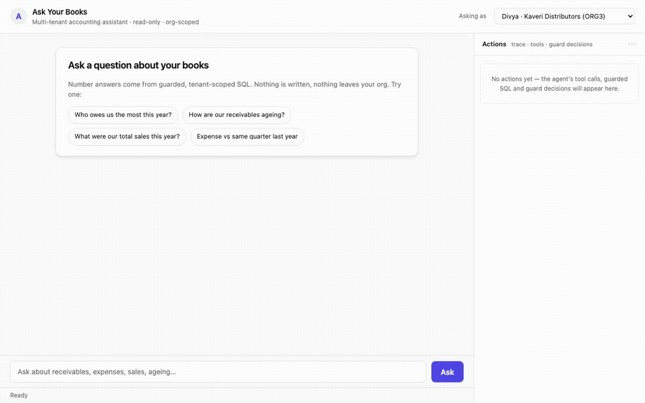

# Ask Your Books 📚

Ask natural-language questions about multi-tenant accounting data — receivables,
ageing, expenses, sales, comparisons — and get **guarded, tenant-scoped,
read-only** answers. Built for the *Effortless AI — Assessment C* brief
(`context/Effortless_AI_Assessment_C_Ask_Your_Books.md`).

## What it does

- **Safe by construction**: every number comes from a guarded query — the LLM
  picks intent, code does arithmetic. SQL sandbox (SQLGuard + sqlglot tenant
  scoping), driver-level read-only SQLite, query timeout and row limits.
- **Multi-tenant**: org is resolved server-side from `X-User-Id`; never from
  the prompt, the body, or the LLM.
- **Cheap + honest**: runs against a deterministic 18-month demo ledger
  (3 orgs, ~20k lines). Free mock LLM for hermetic tests; drop in
  OpenAI/Groq/Ollama via config.
- **Evaluation built in**: 20 questions × 3 runs, compared to independent
  reference SQL → **100% accuracy, 100% consistency** (see
  [docs/EVALUATION.md](docs/EVALUATION.md)).

## Quick start (5 commands)

```bash
make setup        # Python 3.10+ venv + deps + seed + smoke checks (see scripts/setup.sh)
make db           # (re)build books.db — deterministic seed
make app          # http://localhost:8000  → shadcn-style chat UI at /ui
# or talk via terminal:
make cli          # interactive chat as U301
make eval && make test   # 60-turn eval + 37 unit tests
```

`make setup` alone gets you to a working app in ~5 minutes (venv, pinned
deps, deterministic DB, tests, smoke eval); nothing external is required.

```bash
curl -sX POST localhost:8000/api/chat \
  -H 'Content-Type: application/json' -H 'X-User-Id: U301' \
  -d '{"message":"Who owes us the most this year?"}'
```

Use Bruno (collection in `bruno/`) for the same calls with ready assertions.

## Demo

<p align="center">
  
</p>

Asks three questions as two different users (Kaveri Distributors → Acme Traders),
watches the model pick metric tools, and shows the guarded SQL, rows, latency and
guard decisions in the right-hand observability panel.

> Animated GIF (51 s, ~1.7 MB). Full-quality version: [docs/demo.mp4](docs/demo.mp4).

## Architecture (end to end)

```
   browser (/ui, static) · curl · Bruno
        │  POST /api/chat {message, session_id}  +  Header X-User-Id
        ▼
   FastAPI → chat service (agent loop, session memory, follow-ups)
        │  system prompt (OKF entity catalog) + tool schemas + history
        ▼
   LLM client (mock default | openai/groq/ollama/gemini/claude/openrouter)
        │  returns tool_calls only — numbers never come from the model
        ▼
   tool registry → metric handlers (hand-written SQL) + sql_query sandbox
        │
        ▼
   guard layer: read-only check → SQLGuard (keywords/parse/tables/limits)
                → sqlglot AST rewrite — every tenant table scoped to org_id
        │
        ▼
   database: read-only SQLite (demo) / PostgreSQL + RLS (production)
```

- **Client** — static shadcn-style UI at `/ui` (no build step): renders
  markdown answers + result tables, and a per-turn **action observability
  panel** (each tool call: status, rows, latency, guarded SQL, guard decision)
  on the right. It formats INR only — arithmetic never happens in the browser.
- **LLM** — provider-agnostic client over the OpenAI-compatible wire format.
  The deterministic `mock` provider is the default, so the app runs fully
  offline with no key; a real provider is a config swap. The model only picks
  intent + tool arguments.
- **Tools** — curated metric tools (ageing, top debtors, group totals, party
  balances, period comparisons, …) with canonical schemas cover the corpus;
  a guarded `sql_query` escape hatch covers the long tail with the same
  guardrails.
- **Guard layer** — SQLGuard blocks write statements, forbidden keywords and
  non-allow-listed query shapes, then sqlglot rewrites the AST so every tenant
  table is scoped to the authenticated org (verified at runtime). Any sandbox
  or rewrite failure is a **refusal** (`SQLGuardError`), never a crash or a
  row leak.
- **Database** — deterministic 18-month SQLite demo (read-only driver
  `mode=ro` + `PRAGMA query_only=ON`); the Postgres schema in
  `infrastructure/postgres/` mirrors it with RLS policies + observability
  views.

## Repository map

```
src/             core (fy/ageing/money), db, guards (sql/tenant), llm, services, api, tools
config/          settings.yaml — every guardrail/cost/provider knob
frontend/        static shadcn-style UI (served at /ui)
infrastructure/  docker + postgres schema & RLS + systemd/nginx deployment units
bruno/           API collection (health, chat, attack-refusal)
tests/           unit tests + questions.json eval corpus
run_eval.py      the 3× repeat evaluation
seed.py          deterministic demo ledger
okf/             Open Knowledge Format: app schemas + data dictionary
docs/            architecture, modules, data model, guardrails, eval, decisions, infra, glossary
```

## Documented in depth

- [System design](docs/architecture.md) · [Modules](docs/modules.md) ·
  [Data model](docs/data-model.md) · [Guardrails](docs/guardrails.md) ·
  [Evaluation](docs/EVALUATION.md) · [Decisions](docs/decisions.md) ·
  [Infrastructure](docs/infrastructure.md) · [OKF](okf/README.md) ·
  [Vocabulary](docs/glossary.md) ·
  [AI usage](AI_USAGE.md) · [Contributing](CONTRIBUTING.md)

## Key design decisions (alternatives considered)

| Decision | Chosen | Alternatives rejected / why |
|---|---|---|
| Tool design | **Hybrid**: 7 curated metric tools + one guarded `sql_query` escape hatch | *Pure text-to-SQL*: prompt-injected schema + ad-hoc SQL is the classic failure mode — no type safety, hard to guard, expensive per turn. *Pure metric tools*: long-tail questions (“balance for Global Traders”?) dead-end. The curated set covers the 80% corpus exactly; the sandbox covers the rest with identical guardrails. |
| Schema context | OKF entity catalog → one system prompt string, generated from `okf/data/entity_catalog.json` | *Table DDL dump*: leaks org internals and biases the LLM to write SQL. *No context*: model invents accounts/fields. |
| Tenant scoping | **In code** — sqlglot AST rewrite derives every tenant table as a subquery `WHERE org_id = '<resolved org>'`; `voucher_lines` scoped through its `vouchers` join | *Prompt instruction*: explicitly disqualified by the brief. *String `WHERE` injection*: breaks on subqueries, UNIONS, quoting and crafted input. |
| Numbers | LLM chooses tools; **code computes + formats** every figure | *LLM arithmetic*: hallucinated totals on finance data are unacceptable; also fragile and costly to retry. |
| Provider | `mock` default (deterministic, offline, $0); OpenAI-compatible client for OpenAI/Groq/Ollama/LM Studio | Same interface, so providers are a config swap; the guardrails and eval do not depend on the model. |
| Periods | Free text → canonical labels (`FY 2026-27 Q2`) that re-resolve; follow-ups shift the label | *Passing raw phrases through*: “last quarter” between turns drifts or is silently misinterpreted (a real bug found in eval). |

## Eval results & honest analysis

`make eval` = 20 questions × 3 runs = 60 turns against independent reference SQL
(see [docs/EVALUATION.md](docs/EVALUATION.md) for the corpus and method):

| accuracy | consistency | latency | cost |
|:-------:|:----------:|:-------:|:----:|
| **100%** | **100%** | 3 ms/q | $0 (mock) |

**Honest limits** (things the 100% does *not* prove):

1. The mock provider is deterministic, so “consistency” is free — with a real
   LLM, tool *choice* varies and consistency will drop; only the arithmetic
   stays exact. The harness was smoke-verified live with
   `deepseek/deepseek-v4-flash-0731` (via OpenRouter); the 20×3 eval itself
   stayed on mock so it remains hermetic and repeatable.
2. Questions are fixed-phrasing. The eval measures the tool/period/guard
   pipeline, not synonym robustness.
3. Metric answers are compared as value-sorted numeric sets (order-insensitive)
   and ₹/paise are exact; per-bill row shapes are compared on the outstanding
   column only.
4. Real bugs found *by* this eval (all fixed, regressions covered):
   mock lowercasing SQL literals (`'Sundry Debtors'`→zero rows), refused tools
   falling through to “clarify”, Sep-31 quarter-boundary crash, ageing
   buckets off by one day, follow-up periods keeping stale labels, quarter
   phrasing collapsing to the whole year.

## Production at ~2,000 orgs / ~500 M voucher lines (Postgres)

The demo runs SQLite for zero-friction eval; the canonical schema is
`infrastructure/postgres/001-schema-rls.sql`. At scale the design carries over
with four changes:

1. **Isolation** — Postgres **row-level security** on every tenant table
   (policies keyed on a session GUC resolved from the authenticated user),
   **separate DB roles** (the app connects as a read-only role with no write
   or DDL grants; the sync pipeline owns writes), and **views** for
   observability/aggregation on top of the RLS wall — plus the same app-level
   scoping as defense in depth. Read replicas carry the same policies and
   serve the agent; the primary only takes writes from the sync pipeline.
2. **Query protection & latency** — generated SQL runs against a **read
   replica** through PgBouncer with a short `statement_timeout` and `work_mem`
   cap; every curated metric answers from **pre-aggregated summary tables**
   (monthly group/FY/party rollups refreshed incrementally, ~20× smaller than
   raw lines), so the replica only sees index-friendly point queries. Row caps
   + iteration caps stay app-side.
3. **Caching (three layers)** — in-session caches (org, resolved period,
   last metric result) already avoid redundant LLM + SQL work across
   follow-ups; summary tables are the *data-side* cache for the hot paths;
   for a hot Q&A tier the same response is served from a Redis TTL cache keyed
   by (org, canonicalized question, resolved period), invalidated on data
   epochs — cutting both LLM spend and replica load for repeated questions.
4. **Cost & quality** — LLM cost is bounded by per-turn tool/token budgets
   and cached period resolutions; per-org monthly token budgets + alerting on
   cost per answered question. Answer quality is monitored by sampling real
   chats into the same `run_eval.py` harness (labeled payloads → consistency
   + drift scores), and guard events (`logs/`) are shipped to the
   observability pipeline for cross-tenant-leak anomaly detection.

## Configuration

For a real LLM you only supply **provider + key** (+ optionally `LLM_MODEL`);
base URL, default model and eval cost are auto-derived per provider
(`src/llm/providers.py`):

```bash
export LLM_PROVIDER=openai   # openai | groq | ollama | gemini | claude | openrouter
export LLM_API_KEY=sk-...
export LLM_MODEL=gpt-4o-mini # optional — provider default is used when empty
```

This project was built and live-verified with
**`LLM_PROVIDER=openrouter` + `LLM_MODEL=deepseek/deepseek-v4-flash-0731`**
(the only model used during development); any other provider works unchanged —
just supply that provider's key + model.

Copy `.env.example` → `.env` for provider/keys/today/limits (everything else
on that file is optional). Freezing `TODAY=2026-10-01` keeps ageing buckets
and FY resolution stable across runs; unset it to use the real date.
Postgres schema + RLS: `infrastructure/postgres/`.

## License / note

Assessment submission code — no external runtime services required for the
demo; extend the `sql_query` sandbox or add metric tools in
`src/services/metrics_service.py` for new question shapes.

---

**Evaluation status (mock provider, deterministic seed):**

| accuracy | consistency |
|:--------:|:-----------:|
| **100%** | **100%** |